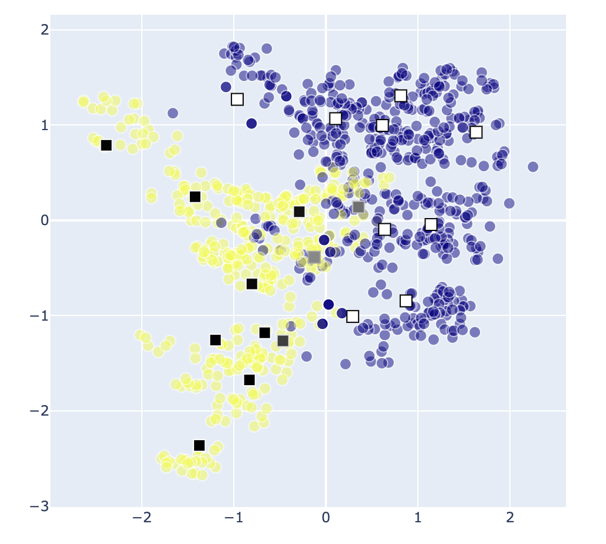

# Prototype-based learning for tabular data

Implementation of prototype-based learning for regression tasks. 

This is the code used in the publication 
[Prototype-based models for real estate valuation: a machine learning model that explains prices](https://papers.ssrn.com/sol3/papers.cfm?abstract_id=4695079). 

*Note: This is research-first code, provided for reproducibility, learning and academic study -- don't expect production-ready, although I did my best to keep it clean, organized and with unit tests.*

### About protoype-based learning

Prototype-based learning is a supervised machine learning model where predictions are based on comparing the input to a set of "prototypes", where close prototypes have a stronger influece on the output.

A prototype can be understood as a representative sample, both in terms of the input and output variables. 

Both the prototypes features and "values" are determined from the training process.

 The image displays a simple example of a dataset of 2 features, 1 binary output. The squares represent the learned prototypes, summarizing the dataset. 

## Installation

1-  Get the data by runing `make get-data` (or see manual download instructions below). 

2- Install necessary packages

Create a virtual environment and install the necessary requirements, e.g. 

    python3 -m venv .env_proto
    source .env_proto/bin/activate
    pip install -r requirements.txt

3- (Optional) Run the tests

    make test

## Notebooks

See the `notebooks/` for examples of usage. 

## Citation
If you use this code, please cite the following article:

    @article{rodriguez2023prototype,
    title={Prototype-based models for real estate valuation: a machine learning model that explains prices},
    author={Rodriguez-Serrano, Jose A},
    journal={Available at SSRN},
    year={2023},
    url={https://papers.ssrn.com/sol3/papers.cfm?abstract_id=4695079}
    }

## Manual data download

The following is necessary to run tests and notebooks: 

UCI Banknote dataset: 
- Download the data from [here](https://archive.ics.uci.edu/static/public/267/banknote+authentication.zip). 
- Unzip, rename the resulting file `banknote.txt` and move it to `data/`.

King county dataset: 

- Download the data from [here](https://geodacenter.github.io/data-and-lab/data/kingcounty.zip). 
- Unzip and move the file `kingcounty/kc_house_data.csv` to `data/`. 
- Remove everything else.

King county prices per square feet: 
- Once the previous files are downloaded, run `python data/scripts/price_per_sqft.py`

